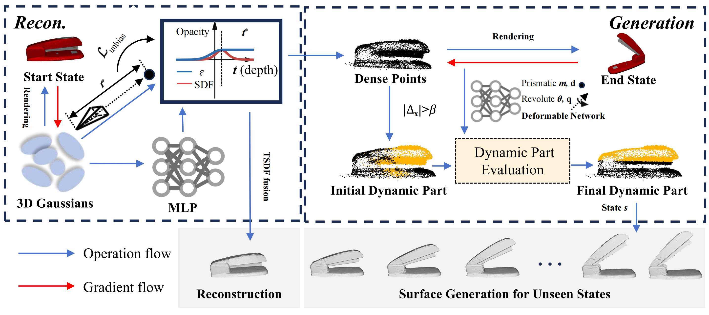

<p align="center">

  <h1 align="center">REArtGS: Reconstructing and Generating Articulated Objects via 3D Gaussian Splatting with Geometric and Motion Constraints
(NeurIPS 2025)
</h1>



# 🚀 Setup
create an anaconda environment using
```

conda create -y -n REActGS python=3.8
conda activate REActGS

pip install torch==1.12.1+cu113 torchvision==0.13.1+cu113 -f https://download.pytorch.org/whl/torch_stable.html
conda install cudatoolkit-dev=11.3 -c conda-forge

pip install -r requirements.txt

pip install submodules/sdf-gaussian-rasterization
pip install submodules/ag-gaussian-rasterization
pip install submodules/simple-knn/

# tetra-nerf for triangulation
cd submodules/tetra-triangulation
conda install cmake
conda install conda-forge::gmp
conda install conda-forge::cgal
cmake .
# you can specify your own cuda path
# export CPATH=/usr/local/cuda-11.3/targets/x86_64-linux/include:$CPATH
make 
pip install -e .
```

# Dataset
Please download the PartNet-Mobility dataset from PARIS <a href="https://1sfu-my.sharepoint.com/personal/jla861_sfu_ca/_layouts/15/onedrive.aspx?id=%2Fpersonal%2Fjla861%5Fsfu%5Fca%2FDocuments%2FProject%2FPARIS%2Fdataset%2Ezip&parent=%2Fpersonal%2Fjla861%5Fsfu%5Fca%2FDocuments%2FProject%2FPARIS&ga=1" title="Onedrive">[Onedrive]</a>
. 

# Reconstruction 
```
# Train script is the SDF-guided 3DGS training
```
<details>
<summary>
Train script:</summary>

```sh
python train_recon.py -s <source_path> -m <model_save_path>/s1 --iterations 30000  --eval --init_num
```
--init_num means using fewer points for initialization
</details>

```
# You also can choose fast train script for acceleration
```
<details>
<summary>
Fast train script:</summary>

```sh
python efficient_train_recon.py -s <source_path> -m <model_save_path>/s1 --iterations 30000  --eval --init_num
```
--init_num means using fewer points for initialization
</details>


# Generation
<details>
<summary>
Train script:</summary>

```sh
python train_gen.py -s <source_path> -m <model_save_path>  --eval --joint_type <p/r>
```
--choose 'p' for prismatic joints or 'r' for revolute joints
</details>

# Reconstructed mesh extraction
<details>
<summary>
Train script:</summary>

```sh
python extract_mesh.py -s <source_path> -m <model_save_path>/s1 --iterations 30000
```
</details>

# Mesh generation
<details>
<summary>
Train script:</summary>

```sh
python generate_mesh.py -s <source_path> -m <model_save_path> --iterations 30000
```
</details>


# Acknowledgements
This project is built upon GOF [Yu, 2024] and ArtGS [Liu 2025]. We thank all the authors for their great work and repos. 

# BibTex
```
@article{wu2025reartgs,
  title={Reartgs: Reconstructing and generating articulated objects via 3d gaussian splatting with geometric and motion constraints},
  author={Wu, Di and Liu, Liu and Linli, Zhou and Huang, Anran and Song, Liangtu and Yu, Qiaojun and Wu, Qi and Lu, Cewu},
  journal={arXiv preprint arXiv:2503.06677},
  year={2025}
}
```